<div align="center">

# riscv-ooo-core

**Dual-Issue Out-of-Order Superscalar RV32I Processor**

1st Place + Special Jury Award — SanDisk Hardware Hackathon · 100+ competing teams

<br/>
<a href="https://devtyagi3909.github.io/riscv-ooo-core/" target="_blank">
  
</a>
<br/>

[](LICENSE)
[](rtl/)
[](scripts/)
[](tb/)

</div>

---

## Overview

A fully synthesizable out-of-order execution engine implementing the Tomasulo algorithm for the RISC-V RV32I ISA. The front-end — fetch, decode, register renaming, and dynamic hazard-aware dispatch — is complete and verified. ROB commit-stage integration is under active development.

The front-end has been verified in simulation with directed self-checking testbenches. The waveform below demonstrates simultaneous dual-issue dispatch with correct RAT allocation and RAW hazard detection working.

---

## Architecture

### Dynamic Execution Flow (Animated)
<p align="center">
  
</p>

### Pipeline Block Diagram

```mermaid
flowchart LR
    classDef fetch fill:#1e40af,stroke:#1e3a8a,stroke-width:2px,color:#fff,rx:4px,ry:4px
    classDef decode fill:#0369a1,stroke:#0284c7,stroke-width:2px,color:#fff,rx:4px,ry:4px
    classDef rename fill:#15803d,stroke:#14532d,stroke-width:2px,color:#fff,rx:4px,ry:4px
    classDef issue fill:#b45309,stroke:#92400e,stroke-width:2px,color:#fff,rx:4px,ry:4px
    classDef execute fill:#c2410c,stroke:#9a3412,stroke-width:2px,color:#fff,rx:4px,ry:4px
    classDef memory fill:#475569,stroke:#334155,stroke-width:2px,color:#fff,rx:4px,ry:4px
    classDef cdb fill:#6d28d9,stroke:#5b21b6,stroke-width:2px,color:#fff,rx:4px,ry:4px
    classDef unwired fill:#1f2937,stroke:#111827,stroke-width:2px,color:#9ca3af,rx:4px,ry:4px,stroke-dasharray: 5 5

    %% Pipeline Stages
    subgraph PC_GEN [1. PC Gen]
        direction TB
        PC[PC Logic<br>Next PC + 8]:::fetch
    end

    subgraph FETCH [2. Fetch]
        direction TB
        IMEM[(Instruction Memory<br>256x32b)]:::memory
        F_Unit[Dual-Issue Fetch<br>Reads 2 Inst/Cycle]:::fetch
    end

    subgraph DECODE [3. Decode]
        direction TB
        D_Unit0[Decoder 0<br>Inst 0]:::decode
        D_Unit1[Decoder 1<br>Inst 1]:::decode
    end

    subgraph RENAME [4. Rename & Dispatch]
        direction TB
        RAT[Register Alias Table<br>32 Arch ➔ 64 Phys]:::rename
        FreeList[(Free List)]:::memory
    end

    subgraph ISSUE [5. Issue]
        direction TB
        IQ[Issue Queue<br>8-Entry Scoreboard]:::issue
        Sched[Scheduler<br>Oldest-Ready Select]:::issue
    end

    subgraph EXECUTE [6. Execute & Writeback]
        direction TB
        PRF[(Physical Reg File<br>64x32b)]:::memory
        ALU[Shared ALU<br>Slot 0 Priority]:::execute
        CDB((Common Data Bus)):::cdb
    end

    subgraph COMMIT [7. Commit]
        direction TB
        ROB[Reorder Buffer<br>32-Entry In-Order Commit]:::unwired
        C_Unit[Commit Unit<br>Retires Arch State]:::unwired
    end

    %% Flow Connections
    PC -->|PC| IMEM
    IMEM -->|64-bit block| F_Unit
    F_Unit -->|Inst 0| D_Unit0
    F_Unit -->|Inst 1| D_Unit1
    
    D_Unit0 -->|Op 0| RAT
    D_Unit1 -->|Op 1| RAT
    FreeList -->|Alloc Phys Reg| RAT
    
    RAT -->|Dispatched Ops| IQ
    IQ <-->|Wakeup & Select| Sched
    Sched -->|Ready Ops| ALU
    
    PRF -->|Read Operands| ALU
    ALU -->|Result| CDB
    CDB -->|Write Data| PRF
    CDB -->|Bypass / Wakeup| IQ
    
    %% Commit connections
    RAT -.->|Alloc Entry| ROB
    CDB -.->|Complete Tag| ROB
    ROB -.->|Retire| C_Unit
    C_Unit -.->|Reclaim Phys Reg| FreeList
    
    %% Branch Mispredict
    ALU -.->|Branch Mispredict<br>Flush| PC
```


---

## Verified Functionality

| Component | Status | Notes |
|-----------|--------|-------|
| 2-wide instruction fetch | Complete | PC + IMEM, handles branch boundaries |
| 2-wide decode | Complete | RV32I full decode, immediate gen |
| Register Alias Table (RAT) | Complete | 32 arch → 64 phys, dual-alloc per cycle |
| Free list management | Complete | Circular free list with head/tail pointers |
| RAW hazard detection | Complete | Combinatorial intra-group bypass, scoreboard |
| Issue queue dispatch | Complete | `issue0_valid` + `issue1_valid` verified in sim |
| CDB broadcast | Complete | `broadcast_valid` confirmed in waveform |
| Execution units (ALU) | Complete | Verified via directed self-check |
| ROB commit stage | In progress | Precise exception support being integrated |

---

## Waveform — Dual-Issue Dispatch Proof


The waveform shows:
- `issue0_valid` and `issue1_valid` asserting simultaneously — dual-issue working
- `prd_0` and `prd_1` incrementing by 2 each active cycle — RAT dual-allocation correct
- `broadcast_valid` asserted — CDB writeback path active
- `free_ptr` advancing correctly — no free list corruption under back-to-back dispatch

---

## Getting Started

### Prerequisites

```bash
# Icarus Verilog with SystemVerilog support
brew install icarus-verilog   # macOS
sudo apt install iverilog     # Ubuntu

# Waveform viewer
# Surfer (recommended): https://surfer-project.org
# or GTKWave: sudo apt install gtkwave
```

### Run Simulation

```bash
git clone https://github.com/devtyagi3909/riscv-ooo-core.git
cd riscv-ooo-core

# Full directed testbench
./scripts/run_verification.sh

# Expected output:
# [PASS] Reset: PC held at 0
# [PASS] 2-wide fetch/decode: ADDI pair decoded correctly
# [PASS] RAT: prd_0/prd_1 allocated, free_ptr +2 on active cycle
# [PASS] Dispatch: issue0_valid and issue1_valid asserted simultaneously
# [PASS] CDB: broadcast_valid observed
# PASS: cpu_tb directed verification completed with no errors.
```

### View Waveform

```bash
surfer waveforms/cpu.vcd
# or
gtkwave waveforms/cpu.vcd
```

---

## Repository Structure

```
riscv-ooo-core/
├── rtl/                  # Synthesizable SystemVerilog
│   ├── fetch/            # 2-wide instruction fetch
│   ├── decode/           # RV32I decode, immediate generation
│   ├── rename/           # RAT, free list, physical register file
│   ├── dispatch/         # Issue queue, hazard scoreboard
│   └── execute/          # ALU, CDB broadcast
├── tb/
│   └── cpu_tb.v          # Directed self-checking testbench
├── scripts/
│   └── run_verification.sh
├── waveforms/
│   └── cpu.vcd
└── assets/
    └── surfer_trace.png  # Waveform screenshot
```

---

## Hackathon Context

This core was built at the **SanDisk Hardware Hackathon** — a 48-hour hardware design competition judged by senior engineers from Sandisk/Western Digital and academic faculty, fielding over 100 teams from across India.

The submission was awarded:
- **1st Place** — overall hardware design category
- **Special Jury Award** — for microarchitectural depth and correctness of the OoO implementation

---

## References

- Patterson & Hennessy — *Computer Organization and Design: RISC-V Edition*
- Tomasulo, R. (1967). *An Efficient Algorithm for Exploiting Multiple Arithmetic Units*
- RISC-V International — [RISC-V ISA Specification](https://riscv.org/technical/specifications/)

---

## License

MIT — see [LICENSE](LICENSE)
